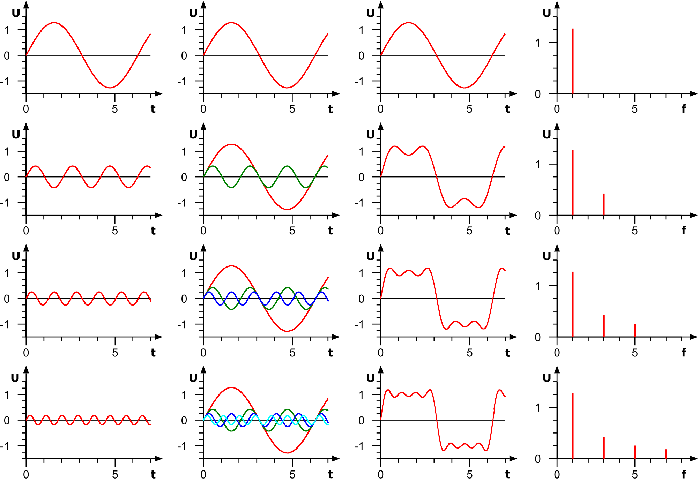

# Zusammenfassung

## Beschreibung der Signale in der Nachrichtentechnik

Es werden nur periodische Signale behandelt

### Sinus

Signalform: $\text{sinusförmig}$
Amplitude: $U_{ss},\hat u_{max},\hat u_{min}, \text{Offset} \ U_{DC}$
Periodendauer: $T$
Delay, Phasenverschiebung: $t_D, \text{Phasenwinkel} \ \varphi $
Frequenz: $f=\frac{1}{T}$

Signalform: $\text{rechteckförmig}$
Amplitude: $(\hat u_{max},\hat u_{min}),u_{max},u_{min} \text{Offset} \ U_{DC}$
Periodendauer: $T,t_i = \text{Impulsdauer}, t_p = \text{Pausendauer},\text{Tastverhältnis}=\frac{t_i}{t_p}$
Delay, Verzögerung: $t_D$
Frequenz: $T = t_i+t_p, f=\frac{1}{T}$

##### Gleichspannungsanteil $U_{DC}$

$U_{DC}=\frac{\hat u_i \cdot t_i + \hat u_p\cdot t_p}{T}$

## Frequenzsynthese

Bei der Frequenzsynthese werden die Momentanwerte der Einzelsignal zur Gesamtamplitude addiert und ergeben den zeitlichen Verlauf des Gesamtsignals $U_a$. Die einzelnen Frequenzen bleiben bei der Überlagerung erhalten und tauchen als Linien im Spektrum auf.

Bei der Darstellung im Frequenzbereich geht eine Phasenverschiebung des Signals im Zeitbereich verloren.

#### Allgemeine Gleichung einer Rechteckschwingung

$w_0=2\pi f_0=Kreisfrequenz \ der \ Grundwelle$

#####

$a_n,b_n=Fourierkoeffizienten$

#####

$u(t)=a_{DC}+\sum_{n=1}^{\infty} [a_n \cdot cos(n\cdot w_0\cdot t)+b_n\cdot sin(n\cdot w_0 \cdot t)]$

#####

$a_{DC}=\frac{1}{T}\cdot \int_{0}^{T} u(t) \,dt$

#####

$a_n= \frac{2}{T}\cdot \int_{0}^{T} u(t)\cdot cos(n\cdot w_0 \cdot t) \,dt$

#####

$b_n= \frac{2}{T}\cdot \int_{0}^{T} u(t)\cdot sin(n\cdot w_0 \cdot t) \,dt$

## Spektraldichtefunktion

Berechnung von symetrischen Signalen, d.h. f(t) = f(-t)

Die Berechnung der Amplitudenwerte des Spektrums mit der Spektraldichtefunktion resultiert aus Analogien und einer Betrachtung der Energieverteilung im Spektrum. Da keine negativen Frequenzen auftreten, wird der negative (rote) Bereich auf den positiven (grünen) Bereich geklappt => die roten werden zu den grünen Linien addiert, d.h. der Betrag verdoppelt sich.

##### Amplitudenwerte

$A_n=u(n\cdot f_0)=2 \cdot \frac{U_{ss}\cdot t_i}{T} \cdot \frac{sin(\pi \cdot n \cdot f_0 \cdot t_i)}{\pi \cdot n \cdot f_0 \cdot t_i}=\frac{2\cdot U_{ss}}{\pi \cdot n}sin(\pi \cdot n \cdot f_0 \cdot t_i)$