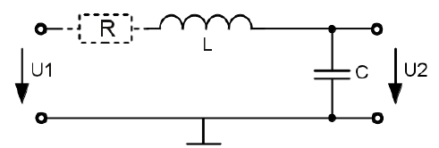

# Zusammenfassung

---

## Beschreibung der Signale in der Nachrichtentechnik

Es werden nur periodische Signale behandelt

### Sinus

Signalform: $\text{sinusförmig}$

Amplitude: $U_{ss},\ \hat u_{max},\ \hat u_{min}$

Offset: $ U_{DC}$

Periodendauer: $T$

Delay, Phasenverschiebung: $t_D, \text{Phasenwinkel} \ \varphi $

Frequenz: $f=\frac{1}{T}$

Signalform: $\text{rechteckförmig}$

Amplitude: $(\hat u_{max},\hat u_{min}),u_{max},u_{min} \text{Offset} \ U_{DC}$

Periodendauer: $T,t_i = \text{Impulsdauer}, t_p = \text{Pausendauer},\text{Tastverhältnis}=\frac{t_i}{t_p}$

Delay, Verzögerung: $t_D$

Frequenz: $T = t_i+t_p, f=\frac{1}{T}$

#### Gleichspannungsanteil $U_{DC}$

$U_{DC}=\frac{\hat u_i \cdot t_i + \hat u_p\cdot t_p}{T}$

#### Allgemeine Gleichung einer Rechteckschwingung

$w_0=2\pi f_0=Kreisfrequenz \ der \ Grundwelle$

#####

$a_n,b_n=Fourierkoeffizienten$

#####

$u(t)=a_{DC}+\sum_{n=1}^{\infty} [a_n \cdot cos(n\cdot w_0\cdot t)+b_n\cdot sin(n\cdot w_0 \cdot t)]$

#####

$a_{DC}=\frac{1}{T}\cdot \int_{0}^{T} u(t) \,dt$

#####

$a_n= \frac{2}{T}\cdot \int_{0}^{T} u(t)\cdot cos(n\cdot w_0 \cdot t) \,dt$

#####

$b_n= \frac{2}{T}\cdot \int_{0}^{T} u(t)\cdot sin(n\cdot w_0 \cdot t) \,dt$

---

## Spektraldichtefunktion

Berechnung von symetrischen Signalen, d.h. f(t) = f(-t)

Die Berechnung der Amplitudenwerte des Spektrums mit der Spektraldichtefunktion resultiert aus Analogien und einer Betrachtung der Energieverteilung im Spektrum. Da keine negativen Frequenzen auftreten, wird der negative (rote) Bereich auf den positiven (grünen) Bereich geklappt => die roten werden zu den grünen Linien addiert, d.h. der Betrag verdoppelt sich.

### Amplitudenwerte

$A_n=u(n\cdot f_0)=2 \cdot \frac{U_{ss}\cdot t_i}{T} \cdot \frac{sin(\pi \cdot n \cdot f_0 \cdot t_i)}{\pi \cdot n \cdot f_0 \cdot t_i}=\frac{2\cdot U_{ss}}{\pi \cdot n}\cdot sin(\pi \cdot n \cdot f_0 \cdot t_i)$

#### Nullstellen für

$sin(\pi \cdot n \cdot f_0 \cdot t_i)=0=sin(\pi \cdot n \cdot \frac{t_i}{T})$
=> $n\cdot f_0 \cdot t_i = m (ganze \ Zahl)$
$n \cdot f_0=m \cdot \frac{1}{t_i} (Nullstellen \ im \ Spektrum \ bei \ \ m \cdot f_0)$

### Bandbreite(Definition)
vereinfacht: $B=\frac{1}{t_i}\ \ \ \text{für} \ t_i=t_p\ \text{folgt}\ \ B=\frac{2}{T}=2\cdot f_0$

---

## Frequenzsynthese

Bei der Frequenzsynthese werden die Momentanwerte der Einzelsignal zur Gesamtamplitude addiert und ergeben den zeitlichen Verlauf des Gesamtsignals $U_a$. Die einzelnen Frequenzen bleiben bei der Überlagerung erhalten und tauchen als Linien im Spektrum auf.

### Erkenntnisse

- Mit höheren Frequenzen nimmt die Amplitude ab, d.h. die Linie bei der Grundwelle hat die höchste Amplitude.
- Bei ti = tp treten nur bei ungeraden Vielfachen der Grundwelle Linien auf.
- Bei ti ungleich tp treten bei allen Vielfachen der Grundwelle Linien auf.
- Es gibt nur bei Vielfachen der Grundwelle Linien.
- Im Spektrum sieht man keine Phasenverschiebung des Signals
- Eine Veränderung des Offsets ändert nur die Linie bei 0 Hz
- Es gibt unendlich viele Spektrallinien
- Die Grundwelle hat die niedrigste Frequenz (>0 Hz)

---

## Leitungen

Hin und Rückleitung zusammengefasst ergibt $R' = 2 \cdot \frac {R'}{2},L' = 2 \cdot \frac {L'}{2}$
Leitungsbelag = Kennwert bezogen auf die Längeneinheit 
z.B. $R'=\frac{2 \Omega}{100m}$

### Vereifachungen (praxisnäher)

- kurzes Leitungsstück => R' ≈ 0 $\Omega$
- hoher Isolationswiderstand => G' ≈ 0S
- hohe Frequenzen

$X_L'=\omega \cdot L' \rightarrow \infty \Omega$

$X_c'=\frac{1}{\omega \cdot C'}\rightarrow 0\Omega$

Daraus fogt R' und G' können vernachlässigt werden

## Energiebetrachtung
      Kapazität     Induktivität
$W = \frac{1}{2} C'\cdot U^2=\frac{1}{2}L'\cdot J^2$

$\frac{U^2}{J^2} = \frac{L'}{C'}=\frac{L \cdot 100m}{C\cdot 100m}=\frac{L}{C}$

$\sqrt{\frac{U^2}{I^2}}=\frac{U}{I}=\sqrt{\frac{L}{C}}$

##### Wellenwiderstand

$\frac{U}{I}=\sqrt{\frac{L}{C}}=Z_w [\frac{V}{A}=\Omega]$

Der Wellenwiderstand Zw ist eine Leitungseigenschaft, unabhängig von der Leitungslänge und abhängig von der Frequenz.
Einheiten: $[C]=\frac{A\cdot s}{V}\ \ \ [L]=\frac{Vs}{A}\ \ \ \ Z_w=\sqrt{\frac{Vs}{A}\frac{V}{As}}=\frac{V}{A}=\Omega$

## Verkürzungsfaktor

Hohe Geschwindigkeit bei kleinem $\epsilon_r$
- hohe Geschwindigkeit bei niedriger Kapazität
    - "schnelle" Kabel müssen kapazitätsarm sein 

## Klirrfaktor K

$K=\frac{\text{Effektivwerte der Spannungen der Oberwellen}}{\text{Effektivwerte der Spannungen des Gesamtsignals}}$

$K=\sqrt{\frac{U_1^2+U_2^2+U_3^2...}{U_0^2+U_1^2+U_2^2+U_3^2...}}$

$U_0 = Amplitude der Grundfrequenz$

## Reflexionsfaktor

$$\left.
\begin{array}{l l}
c = 3\cdot 10^8\frac{m}{s}  \\ 
\vartheta_K = \frac{2}{3} 
\end{array}
\right\\}
\vartheta = \vartheta_K \cdot c=2\cdot 10^8 \frac{m}{s}$$

$$\text{Länge} \ \ L=60m$$

$$\text{Laufzeit im Kabel:}\ \ T_D=\frac{L}{\vartheta}=\frac{60m}{2\cdot 10^8\frac{m}{s}}=300 \cdot 10^{-9}s=300ns$$

$$Z=75\Omega \neq R_L \rightarrow \text{Reflexion}$$

##### Beispiel

$R_L = 50\Omega \ \ \ \ \ \hat u_2=?$

$r=\frac{50\Omega-75\Omega}{50\Omega+75\Omega}=-\frac{1}{5}=-0,2$

$\hat u_2=(1+r)\cdot \hat u_h=(1-0,2)\cdot 0,5V=0,4V$

---

$U_2=\hat u_h +\hat u_r=(\hat i_h -\hat i_r)\cdot R_L$

$\hat u_h+r\cdot \hat u_h=(\hat i_h - r\cdot \hat i_h)\cdot R_L$

$(1+r)\cdot \hat u_h= \hat i_h(1-r)\cdot R_L$

$(1+r)\cdot \cancel{\hat u_h}= \frac{\cancel{\hat u_h}}{Z}(1-r)\cdot R_L$

$(1+r)=\frac{1}{Z}(1-r)\cdot R_L$

$Z+r\cdot Z=R_L-r\cdot R_L$

$r\cdot Z+r\cdot R_L=R_L-Z$

$r(Z+R_L)=R_L-Z$

$$\text{Reflektionsfaktor r}$$

$$\boxed{
\begin{array}{l l}
Festlegungen: \\
\hat u_r= r\cdot \hat u_h \rightarrow r=\frac{\hat u_r}{\hat u_h} \\
\hat u_r = r\cdot \hat i_h \rightarrow r=\frac{\hat i_r}{\hat i_h} \\
\left.
\begin{array}{l l}
\hat u_r = \hat i_r \cdot Z  \\ 
\hat u_h = \hat i_h \cdot Z 
\end{array}
\right\\}
r=\frac{\hat u_r}{\hat u_h}=\frac{\hat i_r \cdot Z}{\hat i_h \cdot Z} \\
r=\frac{R_L-Z}{R_L+Z}
\end{array}
}$$

1) Kurzschluss: $R_L=0\Omega\ \ \ r=\frac{0-Z}{0 + Z}= -1 \rightarrow \text{negative Totalreflexion, Phasensprung um 180°,d.h. Vorzeichenumkehr}$

2) Leerlauf: $R_L=\infty\Omega\ \ \ r=\frac{\infty-Z}{\infty + Z}=1 \rightarrow \text{Totalreflexion}$

3) Anpassung: $R_L=Z \ \ \ r=\frac{Z-Z}{Z + Z}=0 \rightarrow \text{keine Reflexion = angepasst}$

---
## Alle Formeln auf einen Blick

##### Frequenz f

$f=\frac{1}{T}$

##### Gleichspannungsanteil U_DC

$U_{DC}=\frac{\hat u_i \cdot t_i + \hat u_p\cdot t_p}{T}$

##### Amplitude der Spektrallinien

$\frac{2\cdot U_{ss}}{\pi \cdot n}\cdot sin(\pi \cdot n \cdot f_0 \cdot t_i)$

##### Nullstellen im Spektrum

$f_{Null}=m \cdot \frac{1}{t_i}\ \ \ \text{mit m = 1,2,3,4...}$

##### Bandbreite (vereinfachte Rechnung)

$B=\frac{1}{t_i}\ \ \ \text{für}\  t_i =t_p\ \text{gilt}\ B=2\cdot f_0$

##### Klirrfaktor

$K=\frac{\text{Effektivwerte der Spannungen der Oberwellen}}{\text{Effektivwerte der Spannungen des Gesamtsignals}}=\sqrt{\frac{U_1^2+U_2^2+U_3^2...}{U_0^2+U_1^2+U_2^2+U_3^2...}}$

$U_0 = Amplitude der Grundfrequenz$

##### Verkürzungsfaktor Vk

$\vartheta_k = \frac{\vartheta}{c}=\frac{1}{\varepsilon_r}$

$\vartheta= \vartheta_k \cdot c =\lambda \cdot f$

$c=\frac{1}{\sqrt{\varepsilon_0\cdot \mu_0}}$

##### Reflexionsfaktor r

$r=\frac{R_L-Z}{R_L+Z}=\frac{\hat u_r}{\hat u_h}$

###### Reflexionsarten

1) Kurzschluss:                       Reflexion mit entgegengesetzter Polarität und gleicher Amplitude
2) offenes Ende:                     Reflexion mit gleicher Polarität und gleicher Amplitude
3) Anpassung( $R_L=Z$ ):        keine Reflexion

##### (Leitungs -) Wellenwiderstand Z

$Z=\sqrt\frac{L'}{C'}$

##### Ersatzschaltbild Koaxialkabel

Vollständig

###### Vereinfachungen für kurze Kabel mit hoher Frequenz

kurze Leitung bei hoher Frequenz XL >> R => R vernachlässigen
hohe Frequenz Xc << RG => G vernachlässigen

